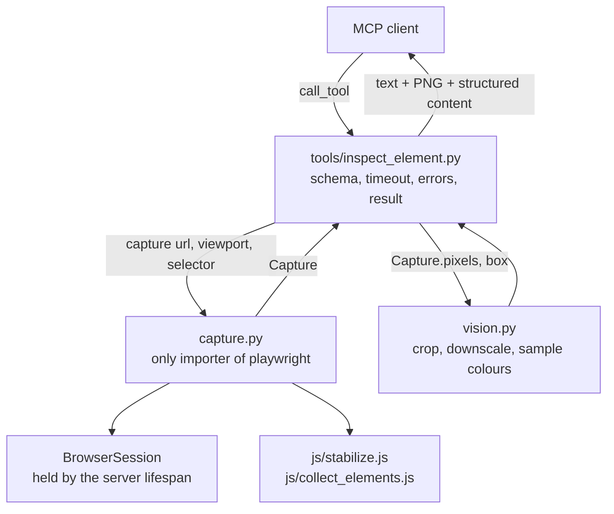

# Capture + inspect_element Design

**Spec**: `.specs/features/capture-inspect-element/spec.md`
**Status**: Approved

Every choice marked "spiked" was run against `mcp 2.3.0`, `playwright 1.63.0` and real Chromium before this document was written.

---

## Architecture Overview



One call: validate the URL scheme, get the shared browser (launching it on first use), open a fresh context, navigate, stabilize, collect the elements matched by the selector, take a full-page screenshot, close the context. The tool then checks the match count, asks vision for the crop and the sampled colours, and builds the result.

---

## Code Reuse Analysis

### Existing Components to Leverage

| Component | Location | How to Use |
| --- | --- | --- |
| Server object and tool registration | `src/squint_mcp/server.py` | Add the lifespan and a second `add_tool` call |
| Tool module pattern (schema + handler in one file) | `src/squint_mcp/tools/ping.py` | Same shape for `tools/inspect_element.py` |
| Config module | `src/squint_mcp/config.py` | Receives every default of this slice |
| In-memory client fixture | `tests/conftest.py` | Becomes session-scoped; gains the fixture-URL and local-server fixtures |
| Test helpers (`texts`, tool lookup) | `tests/test_ping.py` | Same style in `tests/test_inspect_element.py` |
| Playwright's `css` selector engine | dependency | Pierces open shadow roots; no hand-written deep query |
| `PIL.Image.getcolors` | dependency | Exact colour counts; no `numpy` |
| `ToolError` | `mcp.server.mcpserver.exceptions` | Becomes `isError: true` with the message in a text block |

### Integration Points

| System | Integration Method |
| --- | --- |
| MCP SDK lifespan | `MCPServer(..., lifespan=...)` yields the `BrowserSession`; handlers read it from `ctx.request_context.lifespan_context` |
| MCP SDK result conversion | The handler returns `Annotated[CallToolResult, InspectElementResult]`: the model publishes the output schema, the handler supplies content blocks and structured content |

---

## Components

### BrowserSession

- **Purpose**: Own the one Playwright driver and Chromium instance of a server run.
- **Location**: `src/squint_mcp/capture.py`
- **Interfaces**:
  - `async browser() -> Browser` - launches headless Chromium on first use under a lock, returns the same instance afterwards; raises `ToolError` when the launch fails
  - `async close() -> None` - closes the browser and stops the driver
  - `browser_lifespan(server) -> AsyncIterator[BrowserSession]` - the server lifespan: yields a session, closes it on exit
- **Dependencies**: `playwright.async_api`
- **Reuses**: nothing

### capture

- **Purpose**: Produce one stabilized Capture of a page at one viewport.
- **Location**: `src/squint_mcp/capture.py`
- **Interfaces**:
  - `async capture(session, url, viewport, selector) -> Capture`
- **Dependencies**: `BrowserSession`, the two `.js` files, Pillow (to decode the screenshot), `config`
- **Reuses**: Playwright `locator("css=...")` and `evaluate_all`

Steps, in order:

1. Reject a scheme outside `http`, `https`, `file` (before any browser work).
2. `new_context(viewport=..., device_scale_factor=1)`; Playwright's own timeouts are set to 0 so the total timeout is the only clock.
3. `goto(url, wait_until="load")`. A Playwright error here is "Could not load".
4. Run `stabilize.js`: await `document.fonts.ready`, inject a style that zeroes animation and transition durations and delays, then finish (or cancel, when infinite) every running animation, shadow trees included.
5. `wait_for_load_state("networkidle", timeout=3s)`. On timeout: `stabilized = False`, continue.
6. `locator("css=" + selector).evaluate_all(collect_elements.js, properties)`. A Playwright error here is "Invalid selector".
7. `screenshot(full_page=True)`, decoded to an RGB image.
8. Close the context in `finally`.

### Page scripts

- **Purpose**: The JavaScript that runs inside the page (ADR-0001).
- **Location**: `src/squint_mcp/js/stabilize.js`, `src/squint_mcp/js/collect_elements.js`
- **Interfaces**: each file is one function expression, read with `Path.read_text` and passed to `evaluate` / `evaluate_all`
- **Dependencies**: none
- **Reuses**: nothing

### vision

- **Purpose**: Crop, downscale and colour sampling over a Capture's pixels. No browser access.
- **Location**: `src/squint_mcp/vision.py`
- **Interfaces**:
  - `crop(pixels, box) -> Image` - border box plus margin, clamped to the image, downscaled to the size limit when larger
  - `sample_colors(pixels, box) -> list[SampledColor]` - most frequent exact colours in the border box
- **Dependencies**: Pillow, `config`
- **Reuses**: `Image.getcolors`, `Image.thumbnail`

### inspect_element tool

- **Purpose**: Input schema, orchestration, error messages and result shape. No browser or pixel logic.
- **Location**: `src/squint_mcp/tools/inspect_element.py`
- **Interfaces**:
  - `async inspect_element(url: str, selector: str, ctx: Context, viewport: Viewport | None = None) -> Annotated[CallToolResult, InspectElementResult]`
- **Dependencies**: `capture`, `vision`, `config`
- **Reuses**: the `tools/ping.py` module shape

---

## Data Models

```python
class Viewport(BaseModel):  # tool input and output
    width: int  # >= 1
    height: int  # >= 1


class Box(BaseModel):  # border box, CSS px, page coordinates
    x: float
    y: float
    w: float
    h: float


class Edges(BaseModel):
    top: float
    right: float
    bottom: float
    left: float


class Size(BaseModel):
    w: float
    h: float


class BoxModel(BaseModel):
    margin: Edges
    border: Edges
    padding: Edges
    content: Size


class Element(BaseModel):  # one element as collected in the page
    box: Box
    box_model: BoxModel  # "boxModel" on the wire
    computed: dict[str, str]


@dataclass(frozen=True)
class Capture:  # CONTEXT.md: DOM/CSS data together with rendered pixels
    viewport: Viewport
    stabilized: bool
    elements: list[Element]  # the elements matched by the call's selector
    pixels: Image.Image  # full page, RGB, 1 image px = 1 CSS px


class SampledColor(BaseModel):
    hex: str  # "#rrggbb"
    share: float  # fraction of the box's pixels, 4 decimals


class InspectElementResult(BaseModel):  # structured content, camelCase on the wire
    viewport: Viewport
    stabilized: bool
    box: Box
    box_model: BoxModel
    computed: dict[str, str]
    sampled_colors: list[SampledColor]
```

**Relationships**: `Element` is validated from the collector's JSON, which gives pyright real types at the page boundary. `Capture` is the whole contract between browser code and everything after it (ADR-0002). Slice 3 extends what `elements` holds; it does not change who may import `playwright`.

Tool result content: `[TextContent(summary), ImageContent(PNG crop)]`, plus the structured content above.

---

## Error Handling Strategy

Every anticipated failure is a `ToolError`. The SDK turns it into `isError: true` with the text `Error executing tool inspect_element: <message>`.

| Error Scenario | Handling | Message |
| --- | --- | --- |
| Scheme not `http`, `https`, `file` | Checked in `capture` before the browser is touched | `Unsupported URL scheme "ftp"; use http://, https:// or file://.` |
| Chromium cannot be launched | Playwright error caught around `launch` | `Could not launch Chromium: <first line of the Playwright error>. If it is not installed, run: playwright install chromium` |
| Navigation fails | Playwright error caught around `goto` | `Could not load <url>: <first line of the Playwright error>` |
| Selector is not valid CSS | Playwright error caught around `evaluate_all` | `Invalid selector "div[".` |
| Selector matches nothing | Checked in the tool | `Selector "#x" matched no elements.` |
| Selector matches several | Checked in the tool | `Selector ".x" matched 2 elements; it must match exactly one.` |
| Matched element has zero width or height | Checked in the tool | `Selector "#x" matched an element with no rendered box.` |
| Total timeout | `TimeoutError` from `asyncio.timeout` caught in the tool | `Timed out after 30s.` |
| Network never idle | Not an error | `stabilized: false` |
| Invalid arguments | SDK validation against the input schema | pydantic's message, naming the field |
| Anything else | SDK treats it as a crash | `Error executing tool inspect_element` (traceback on stderr) |

---

## Risks & Concerns

| Concern | Location (file:line) | Impact | Mitigation |
| --- | --- | --- | --- |
| The exact-tool-list test breaks when a tool is added | `tests/test_ping.py:34` | Fails on registration of `inspect_element` | Expected (spec, Assumptions). Rewritten in the task that registers the tool, to assert the new exact list |
| The `client` fixture is function-scoped | `tests/conftest.py:11` | One lifespan, so one Chromium launch, per test | Made session-scoped with a session-scoped `anyio_backend`; `ping` tests are stateless and unaffected |
| `docs/SPEC.md` says "FastMCP" and lists `numpy`/`coloraide` in the stack | `docs/SPEC.md:135` | Reader may expect them in this slice | Out of this slice's scope to edit; recorded in the spec's Assumptions |
| A selector containing Playwright's `>>` chains engines | `src/squint_mcp/capture.py` (new) | A caller can use non-CSS Playwright syntax | Accepted: local read-only tool, the result is still one element or an error |
| Sub-pixel boxes (text spans have fractional widths) | `src/squint_mcp/vision.py` (new) | Crop bounds need integers | Floor the top-left, ceil the bottom-right, then clamp |
| Exact colour counting on gradients and photos | `src/squint_mcp/vision.py` (new) | Top colours are thin bands, not perceptual clusters | Marked with a `ponytail:` comment; slice 4 defines the sampling its Check needs |
| `finally: context.close()` runs after a timeout cancelled the task | `src/squint_mcp/capture.py` (new) | A level-triggered cancel scope would cancel the cleanup too | `asyncio.timeout` cancels once, so the cleanup await runs; verified by the test that calls again after a timeout |

---

## Tech Decisions

| Decision | Choice | Rejected alternative | Rationale |
| --- | --- | --- | --- |
| Where the browser lives | In a `BrowserSession` yielded by the server lifespan. Launched on the first call that needs it, under a lock; closed when the lifespan exits | A module-level global closed with `atexit` | The lifespan gives a real shutdown path and ties the browser to the event loop that created it. A global is bound to whichever loop first used it and cannot be reset between in-memory clients. Spiked: each `Client(server)` enters its own lifespan, so a second client with no Chromium reproduces "not installed" without touching internals |
| Isolation per call | `browser.new_context()` per call, closed in `finally` | One long-lived context with a new page per call | Contexts do not share cookies or storage; pages in one context do |
| Total timeout | `asyncio.timeout(config.TOTAL_TIMEOUT_S)` around the whole handler body, launch included. Playwright's default timeouts are disabled so there is one clock | Passing `timeout=` to each Playwright call and budgeting the remainder | One bound instead of a budget threaded through every call; it also covers the launch and the vision step |
| What a timeout returns | `isError: true`, message `Timed out after 30s.` No partial data | A normal result with a `timedOut` flag and whatever was collected | A half-stabilized Capture is not a Capture; the caller must not mistake it for one |
| Output format | `content` = one text summary + one PNG image block; `structuredContent` = `viewport`, `stabilized`, `box`, `boxModel`, `computed`, `sampledColors` | Base64 PNG inside the structured content | MCP clients render image blocks; base64 in JSON is paid for as text tokens |
| Computed styles returned | A fixed list of 20 properties in config | Every property `getComputedStyle` reports | 350+ properties per call defeats the token-cost goal |
| Pixels | Full-page screenshot | Viewport-only screenshot | Elements below the fold need pixels too |
| Zeroing animations | Injected `!important` style plus `finish()`/`cancel()` on `document.getAnimations()` | Playwright's `screenshot(animations="disabled")` | The screenshot option restores animations afterwards, so the collected styles could disagree with the pixels. The style covers animations that start later; `getAnimations()` covers shadow trees |
| Colour counting | `PIL.Image.getcolors` | `numpy.unique` | Same result without a new dependency |
| Chromium missing: runtime | Any launch failure returns one message that names the fix | Detecting the "Executable doesn't exist" text and branching | No string-sniffing of Playwright's wording; the fix is named either way |
| Chromium missing: tests | Tests fail with the tool's message. No skip marker | `pytest.skip` when Chromium is absent | A skip turns a broken CI install into a green run |
| Tests with real Chromium | One session-scoped in-memory client, so one lifespan and one browser for the run. Fixtures over `file://`; a stdlib `ThreadingHTTPServer` for the polling page and the URL that never answers. CI runs `uv run playwright install --with-deps chromium` before pytest | A browser fixture injected into the server | The server owns its browser exactly as in production; tests only choose how long the client lives |
| Timeout test | Lower `config.TOTAL_TIMEOUT_S` with `monkeypatch`; the handler reads it at call time | A real 30s test | Keeps the suite fast; call and assertions still cross the MCP boundary |

Project-level decisions are recorded in `.specs/STATE.md` as AD-001 and AD-002.
